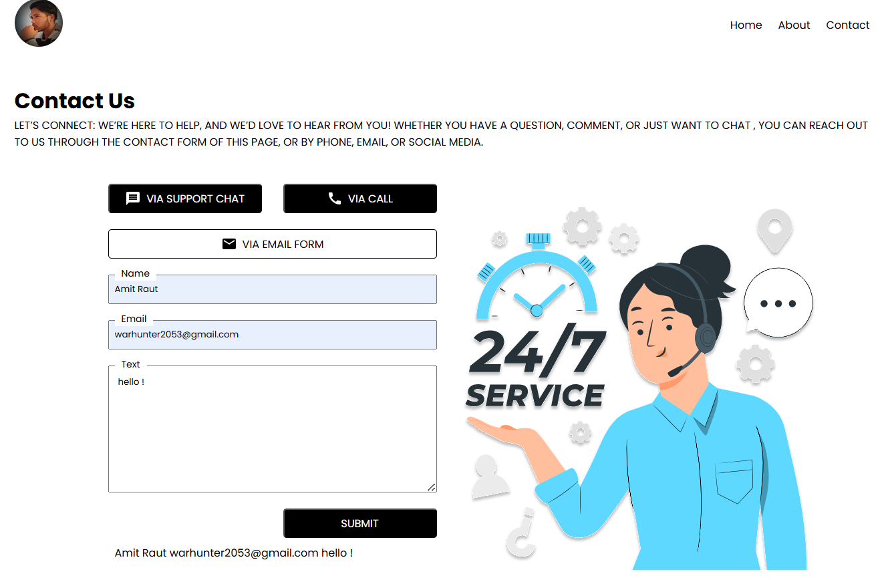

# Contact Us Page - React Application  

## 📝 Overview  
A modern **Contact Us** page built with **React**, featuring a responsive form with multiple contact options (support chat, call, and email). The form captures user inputs (name, email, and message) and displays them upon submission using React's `useState` for state management.  

### 🔥 Features  
✔ **Multiple Contact Options**  
- Support Chat (via button)  
- Call (via button)  
- Email Form (with input validation)  

✔ **Interactive Form**  
- Name, Email, and Message fields  
- Form submission handling with `useState`  
- Displays submitted data dynamically  

✔ **Responsive Design**  
- Works on desktop & mobile  
- Clean UI with floating labels  

✔ **React Features Used**  
- **`useState`** for form state management  
- **React Icons** (MdMessage, MdCall, MdEmail)  
- Modular CSS styling  

## 🛠️ Installation & Setup  
1. **Clone the repository**  
   ```sh
   git clone https://github.com/your-username/contact-us-page.git
   cd contact-us-page
   ```  

2. **Install dependencies**  
   ```sh
   npm install
   # or
   yarn install
   ```  

3. **Run the app**  
   ```sh
   npm start
   # or
   yarn start
   ```  
   The app will open at `http://localhost:3000`.  

## 📂 Project Structure  
```
src/
├── components/
│   ├── Button/          # Reusable button component
│   ├── ContactForm/     # Main Contact Us form logic
├── App.js               # Main app entry
├── index.css            # Global styles
```  

## 🎨 Styling  
- **CSS Modules** for scoped styling  
- **Flexbox** for responsive layouts  
- **React Icons** for button icons  

## 🚀 Future Improvements  
- Add form validation (e.g., check for valid email)  
- Connect to a backend API for real submissions  
- Add animations for better UX  

## 📸 Screenshot  
  

## ⚖️ License  
MIT  

---

### 💡 How It Works  
1. User fills in the form (name, email, message).  
2. On submission, the data is captured using `useState`.  
3. Submitted data is displayed below the form.  

Built with ❤️ using **React**. Contributions welcome! 🚀
